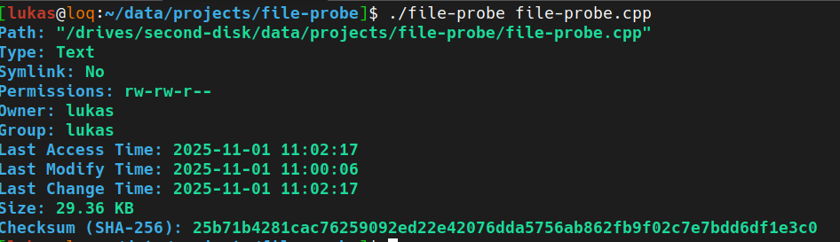

# File probe
Basic utility for get information about files and directories.

## Preview


## Usage
```bash
file-probe <path>
```

## Build from source
```bash
git clone git@github.com:lukasbecvar/file-probe.git
cd file-probe
make
```

## Installation
```bash
git clone git@github.com:lukasbecvar/file-probe.git
cd file-probe
sudo make install
```

## License
This software is licensed under the [MIT license](LICENSE).
